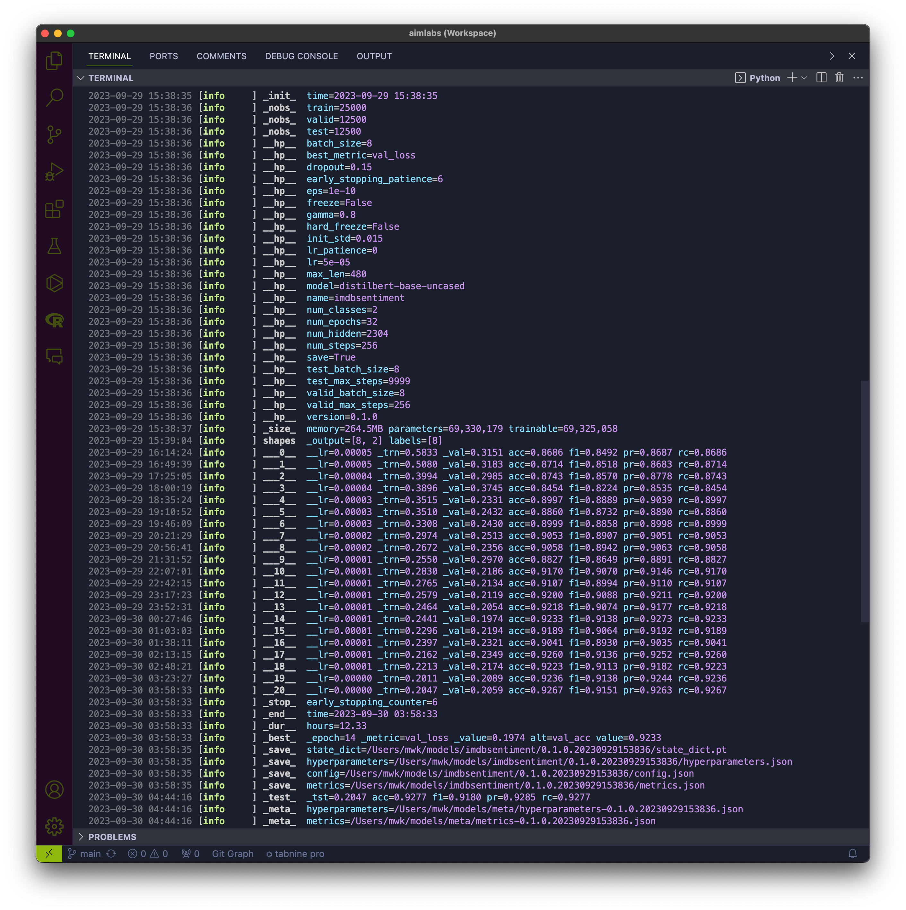

# A.I. Message Labels

Packaging and pipelines for deep learning text classification models

## Installation

```bash
make develop
```

## Testing

```bash
make test
```

## Usage

```bash
.venv/bin/python scripts/train.py \
    --num-epochs 32 \
    --gamma 0.8 \
    --num-steps 16 \
    --lr 0.0001 \
    --batch-size 128 \
    --name imdbsent
```

## Training



## Testing


